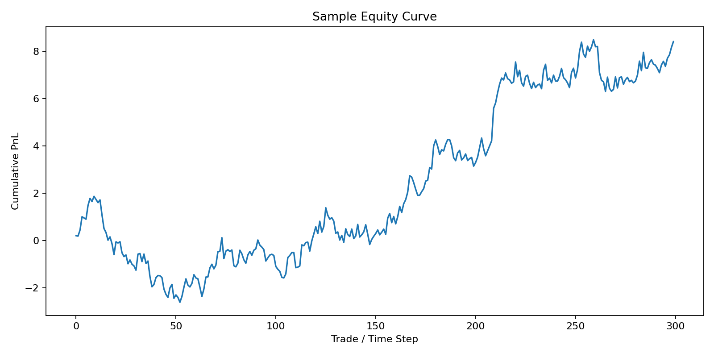

# 🚀 Lead–Lag Trading System (End-to-End MLE + Quant Project)


---

## 📌 Overview

This project builds a **production-style machine learning system** to detect and trade **lead–lag relationships** between two time series.

It simulates a realistic quant workflow:

> Signal Research → Feature Engineering → Model → Backtest → API Deployment

---

## 🧠 Problem Statement

In financial markets, some assets **lead others with a delay**.

Goal:
- Predict **future returns of asset Y**
- Using **past behavior of asset X**
- Convert predictions into **trading signals**
- Evaluate via **backtesting with costs**

---

## 🏗 System Architecture

```text
Raw Data
   ↓
Feature Engineering (lags, returns)
   ↓
Model Training (Ridge Regression)
   ↓
Signal Generation
   ↓
Backtesting Engine
   ↓
Model Serialization
   ↓
FastAPI + Uvicorn (Real-time inference)
```

---

## ⚙️ Tech Stack

| Layer | Tools |
|---|---|
| Data Processing | Pandas, NumPy |
| Modeling | Scikit-learn (Ridge) |
| Backtesting | Custom Python Engine |
| API Serving | FastAPI + Uvicorn |
| Serialization | Joblib |
| Testing | Pytest |
| Visualization | Matplotlib |
| Containerization | Docker |

---

## 📂 Project Structure

```text
lead-lag-trading/
├── data/
│   └── sample.csv
├── src/
│   ├── features.py
│   ├── model.py
│   └── backtest.py
├── artifacts/
│   ├── model.joblib
│   └── feature_columns.joblib
├── tests/
├── config.py
├── train.py
├── main.py
├── api.py
├── generate_data.py
├── requirements.txt
├── Dockerfile
└── README.md
```

---

## 📊 Feature Engineering

- Lagged returns of X and Y
- Autoregressive signals
- Cross-asset dependency modeling

```text
X_lag_1 ... X_lag_k
Y_lag_1 ... Y_lag_k
target = Y_return(t+1)
```

---

## 🧠 Model

- Ridge Regression (L2 regularization)
- Handles multicollinearity in lag features
- Predicts next-step return

```text
ŷ(t+1) = f(X_lags, Y_lags)
```

---

## 📈 Backtesting Engine

### Signal Logic
- Long when prediction > threshold
- Short when prediction < -threshold

### Includes
- Transaction costs
- Position changes
- Realistic PnL computation

---

## 📊 Example Output

### Equity Curve



> Replace this sample image with your actual backtest output after running `main.py`.

To save your own curve from `main.py`, use:

```python
plt.plot(equity)
plt.title("Equity Curve")
plt.xlabel("Time")
plt.ylabel("Cumulative PnL")
plt.tight_layout()
plt.savefig("equity_curve.png", dpi=160)
plt.show()
```

---

## ▶️ How to Run

### 1. Install dependencies

```bash
pip install -r requirements.txt
```

### 2. Generate synthetic data

```bash
python generate_data.py
```

### 3. Train model

```bash
python train.py
```

### 4. Run backtest

```bash
python main.py
```

### 5. Start API server

```bash
python -m uvicorn api:app --reload
```

Open:

```text
http://127.0.0.1:8000/docs
```

---

## 🔌 API Usage

### POST `/predict`

#### Input

```json
{
  "features": {
    "X": 100,
    "Y": 90,
    "X_ret": 0.2,
    "Y_ret": -0.1,
    "X_lag_1": 0.1,
    "X_lag_2": 0.05
  }
}
```

#### Output

```json
{
  "prediction": 0.0123
}
```

---

## 🐳 Docker

### Example `Dockerfile`

```dockerfile
FROM python:3.10-slim

WORKDIR /app

COPY requirements.txt .
RUN pip install --no-cache-dir -r requirements.txt

COPY . .

EXPOSE 8000

CMD ["python", "-m", "uvicorn", "api:app", "--host", "0.0.0.0", "--port", "8000"]
```

### Build the image

```bash
docker build -t lead-lag-trading .
```

### Run the container

```bash
docker run -p 8000:8000 lead-lag-trading
```

Then open:

```text
http://127.0.0.1:8000/docs
```

---

## 🧪 Testing

```bash
pytest
```

---

## 🎥 Demo

A short API demo GIF is a great upgrade for GitHub, but it needs to be recorded on your machine. A simple workflow:

1. Start the API with `python -m uvicorn api:app --reload`
2. Open `/docs`
3. Submit one `POST /predict` request
4. Record 10–15 seconds with ScreenToGif, Kap, or Peek
5. Save it as `demo.gif`
6. Add this line to the README:

```markdown

```

---

## 🔥 Key Highlights

- End-to-end ML pipeline from research to serving
- Time-series feature engineering for lag structure
- Transaction-cost-aware backtesting
- Model serialization and API deployment
- Modular repo structure for extension and testing

---

## 🚀 Future Improvements

- Walk-forward validation
- Hyperparameter tuning
- XGBoost or LSTM baseline
- Live data stream ingestion
- CI/CD pipeline
- Feature store integration

---

## 🧠 Interview Talking Points

- Built a lead–lag predictive trading system
- Designed a time-series feature pipeline
- Implemented realistic backtesting with costs
- Exposed model inference through a low-latency API
- Demonstrated a full ML lifecycle with deployment-oriented design

---

## 📌 Author

Machine Learning Engineering Portfolio Project  
(Quant + ML + Systems Focus)
